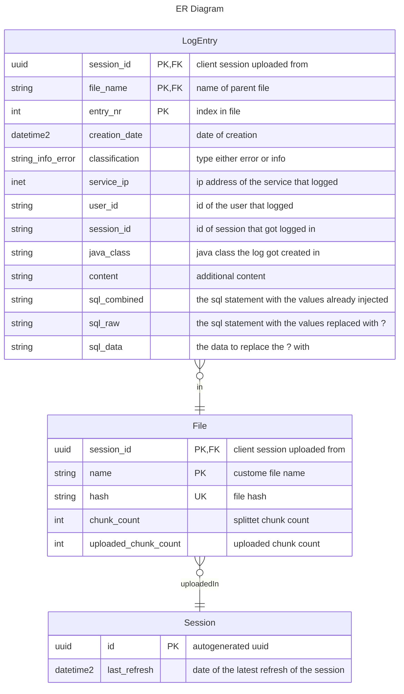

```mermaid
---
title: ER Diagram
---

erDiagram
    File }o--|| Session: uploadedIn
    File {
        uuid session_id PK,FK "client session uploaded from"
        string name PK "custome file name"
        string hash UK "file hash"
        int chunk_count "splittet chunk count"
        int uploaded_chunk_count "uploaded chunk count"
    }
    LogEntry }o--|| File: in
        LogEntry {
        uuid session_id PK,FK "client session uploaded from"
        string file_name PK, FK "name of parent file"
        int entry_nr PK "index in file"
        datetime2 creation_date "date of creation"
        string_info_error classification "type either error or info"
        inet service_ip "ip address of the service that logged"
        string user_id "id of the user that logged"
        string session_id "id of session that got logged in"
        string java_class "java class the log got created in"
        string content "additional content"
        string sql_combined "the sql statement with the values already injected"
        string sql_raw "the sql statement with the values replaced with ?"
        string sql_data "the data to replace the ? with"
    }
    Session {
        uuid id PK "autogenerated uuid"
        datetime2 last_refresh "date of the latest refresh of the session"
    }
```